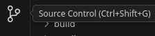
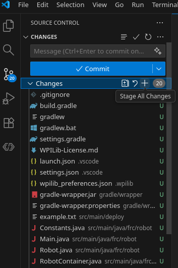

# Software Bootcamp Tutorial
Created Saturday 18 July 2026

Steps
=====
Create A Project
----------------

1. Start "FRC VS Code"
2. Click `Ctrl-Shift-P` to open the Command Pallette
3. Select "WPILib: Create New Project"
4. In the WPILib New Project Creator, select the following items:
	1. Project Type: "template"
	2. Language: "java"
	3. Project Base: "Command Robot"
	4. Select a Project folder (the project will be created in a folder under this folder)
	5. Project Name: "VS-FRC-Tutorial-2026"
	6. Create New Folder: Checked
	7. Team Number: "10257"
	8. Enable Desktop Support: Checked
	9. Click "Generate Project"

> >   

Commit the New Project
----------------------

### Initialize the Git Repo

1. Click the Source Control Button



2. Click the "Initialize Repository" button


### Stage and Commit the Changes

1. Click the `+` button Next to "Changes" to Stage all of the new files.



2. In the Message box, type "Commit initial Project."
3. Click the `Commit " button.


Create an LedController Subsystem
---------------------------------

1. In the Explorer View, find and  `src/main/java/frc/robot/subsystems`
2. Copy/Paste the "ExampleSubsystem.java" file to a new file called "LedControllerSubsystem.java"
3. In the new file, Search and Replace
	1. Search: "ExampleSubsystem" (whole word only)
	2. Replace "LedControllerSubsystem"
	3. Replace all
4. Find and open RobotContainer.java
	1. In the class definition, declare a new instance of the LedControllerSubsystem.

```java
public class RobotContainer {
  // The robot's subsystems and commands are defined here...
  private final ExampleSubsystem m_exampleSubsystem = new ExampleSubsystem();
  // Create a new LED Controller Subsystem
  private final LedControllerSubsystem m_ledSubsystem = new LedControllerSubsystem();
```


1. 


6. 


