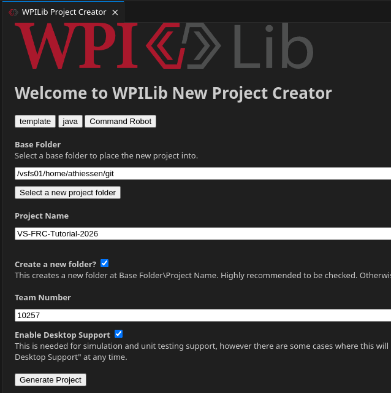

# Software Bootcamp Tutorial
Created Saturday 18 July 2026

Steps
=====
Create A Project
----------------

1. Start "FRC VS Code"
2. Click `Ctrl-Shift-P` to open the Command Pallette
3. Select "WPILib: Create New Project"
4. In the WPILib New Project Creator, select the following items:
	1. Project Type: "template"
	2. Language: "java"
	3. Project Base: "Command Robot"
	4. Select a Project folder (the project will be created in a folder under this folder)
	5. Project Name: "VS-FRC-Tutorial-2026"
	6. Create New Folder: Checked
	7. Team Number: "10257"
	8. Enable Desktop Support: Checked
	9. Click "Generate Project"

> >   

Commit the New Project
----------------------

### Initialize the Git Repo

1. Click the Source Control Button


2. Click the "Initialize Repository" button


### Stage and Commit the Changes

1. Click the `+` button Next to "Changes" to Stage all of the new files.


2. In the Message box, type "Commit initial Project."
3. Click the `Commit " button.


Create an LedController Subsystem
---------------------------------

1. In the Explorer View, find and  `src/main/java/frc/robot/subsystems`
2. Copy/Paste the "ExampleSubsystem.java" file to a new file called "LedControllerSubsystem.java"
3. In the new file, Search and Replace
	1. Search: "ExampleSubsystem" (whole word only)
	2. Replace "LedControllerSubsystem"
	3. Replace all
4. Find and open RobotContainer.java
	1. In the class definition, declare a new instance of the LedControllerSubsystem.

```java
public class RobotContainer {
  // The robot's subsystems and commands are defined here...
  private final ExampleSubsystem m_exampleSubsystem = new ExampleSubsystem();
  // Create a new LED Controller Subsystem
  private final LedControllerSubsystem m_ledSubsystem = new LedControllerSubsystem();
```

Turn on an LED
--------------

1. In LedControllerSubsystem, 
	1. declare a new [DigitalOutput]() object named m_led in the class definition so that it has global scope.
	2. initialize the variables inside the constructor
	3. turn the LED on at the time of construction.


```java
public class LedControllerSubsystem extends SubsystemBase {
  private final DigitalOutput m_led;

  public LedControllerSubsystem() {
  	m_led = new DigitalOutput(0);
  	m_led.set(true);
  }
```


2. Deploy this code to the RoboRIO.
	1. Plug usb cable into [RoboRIO]()
	2. Shift+F5 to deploy

3. Extra Challenge: Control an LED plugged into a different DIO port.


Blink the LED
-------------
Let's cause the LED to blink by using the LedControllerSubsystem's periodic method, which is called every 20 ms. First, we need a variable that tracks the state of the LED, then we can query that state before decided what to do with the LED.

1. Create a new led_state variable.

```java
public class LedControllerSubsystem extends SubsystemBase {
  private final DigitalOutput m_led;
  private boolean led_state;

  public LedControllerSubsystem() {
  	m_led = new DigitalOutput(0);
  	m_led.set(true);
  	led_state = true;
  }
```

2. Create a conditional in the periodic method that sets the LED true if false and false if true, then update the led_state.

```java
  @Override
  public void periodic(){ 
      if (led_state){
      	m_led.set(false);
      	}
      else{
      	m_led.set(true);
      	}
      led_state = !led_state;
  }

```

3. Deploy the code with Shift+F5.

4. Extra Challenge: Change the blinking frequency to stay on for 1 second, then off for 1 second, repeatedly.


Control the LED with a physical button
--------------------------------------
Next we'll wire a button into the [RoboRIO]() and program it to turn the LED on when pressed.


1. Create a new [DigitalInput]() object in the [LedControllerSubsystem]() class definition.
2. Initialize its value in the constructor

```java
public class LedControllerSubsystem extends SubsystemBase {
  private final DigitalOutput m_led;
  private final DigitalInput m_button;

  public LedControllerSubsystem() {
  	m_led = new DigitalOutput(0);
  	m_led.set(true);
  	m_button = new DigitalInput(1);
  }
```

3. Create a new method that returns the state of the button.

```java
  public boolean getButtonState() {
    if (m_button.get()){         
      return true;
    }
    else{                  
      return false;
    }
```

4. Setup a new Command method that turns on the LED.

```java
public Command turnOn({                                                                                                                                                   
	return new StartEndCommand(() -> m_led.set(true), () -> m_led.set(false), this);
}
```


5. Create a trigger that uses the condition of getButtonState to issue the turnOn command. This is done in RobotContainer.java.

```java
private void configureBindings() {
    // Schedule `turnOn` when `getButtonState` changes to `true`
    new Trigger(m_ledSubsystem::getButtonState)
        .whileTrue(m_ledSubsystem.turnOn());
  }
```


6. Deploy to the RoboRIO. Make sure driver station is running.


Control the LED with a gamepad button
-------------------------------------
This time we'll control the LED with the gamepad controller.


1. In RobotContainer.java, link the controller "b" button to this new command.

```java
  private void configureBindings() {
    // Schedule `turnOn` when `getButtonState` changes to `true`
    new Trigger(m_ledSubsystem::getButtonState)
        .whileTrue(m_ledSubsystem.turnOn());

    // Schedule `turnOn` when the Xbox controller's B button is pressed,
    // cancelling on release.
    m_driverController.a().whileTrue(m_ledSubsystem.turnOn());
	m_driverController.b().whileTrue(m_ledSubsystem.turnOff());
  }
```


2. Deploy to the [RoboRIO]()
3. Start the [DriverStation]()
4. Select Enable
5. Test the controller


Print to screen on button press
-------------------------------
Let's cause text to print to the scren when a controller button is pressed.

1. Make a method that prints to the screen.

```java
private void printMessage(){
  return runOnce(() -> System.out.println("Pressed controller button!"));
  }  
```

2. Link this method to a controller button in RobotContainer.java.

```java
  private void configureBindings() {
    // Schedule `turnOn` when `getButtonState` changes to `true`
    new Trigger(m_ledSubsystem::getButtonState)
        .whileTrue(m_ledSubsystem.turnOn()); 
		
    // Schedule `turnOn` when the Xbox controller's A button is pressed,
    // cancelling on release.
    m_driverController.a().whileTrue(m_ledSubsystem.turnOn());
	m_driverController.b().whileTrue(m_ledSubsystem.turnOff());
    m_driverController.x().onTrue(m_ledSubsystem.printMessage());
  }
```

3. Deploy to RoboRIO.
4. Start and enable the [DriverStation]()
5. Press X on the gamepad and on the computer keyboard.
6. Extra Challenge: What happens when you press multiple buttons at once?


